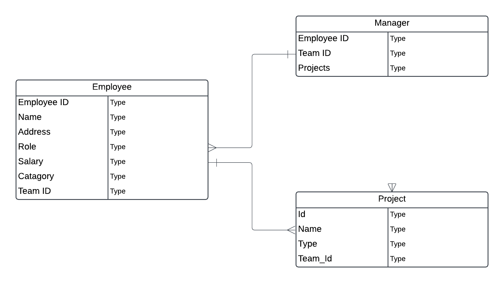

# Project Tracker

This is a Full Stack Web App made in .NET to help users build and persist their Project teams to a backend. 

## Project Members
- Prabveer Pannu

## Project Requirements
- Application must build and run.
- Unit Testing (70% code coverage for Services and Models layer)
- Backend hosted on Azure Cloud Service

## Tech Stack

- React/JS (Front End)
- C# (Back End Programming Language)
- SQL Server (Azure Hosted)
- EF Core (ORM Tech)
- ASP.NET (Web API Framework)
- HTML, CSS

## User Stories
- User should be able to login/logout if they already have an account
- User should be able to register if they do not have an account
- User should be able to create a new Employee
- User should be able to select date to gain infromation about project handling
- User should be able to customize Employee information for each Employee
- User should be able view all Projects orders
- User should be able to delete Project orders that they don’t need

## Tables

## MVP Goals
- User can create teams of Employees to work on a project
- User can view previous teams and thier project success rate
- user can delete teams
- user can customize teams

## Stretch Goals
- Implement login/logout and register functionality to allow for multiple users
- User authentication and password encryption
- Login using google, facebook account
- Possibly implement Dockersize for packaging application
